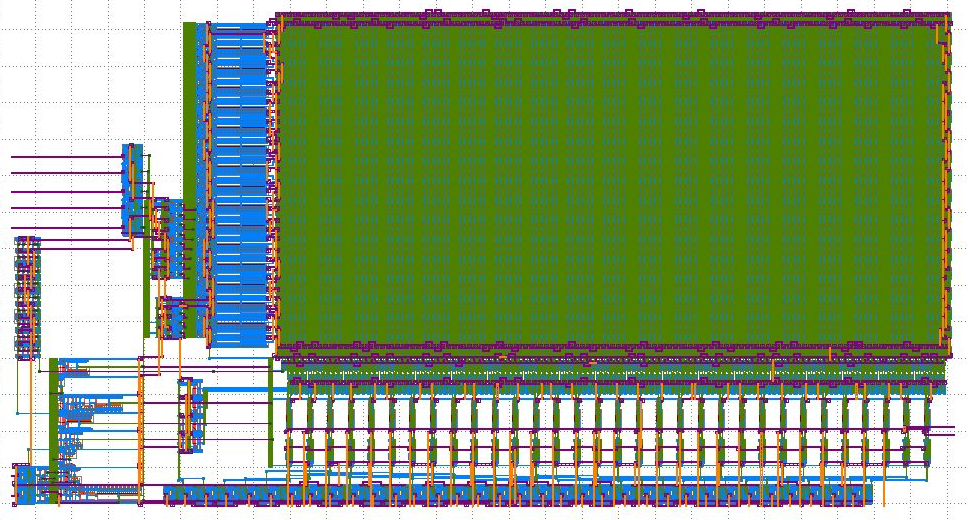
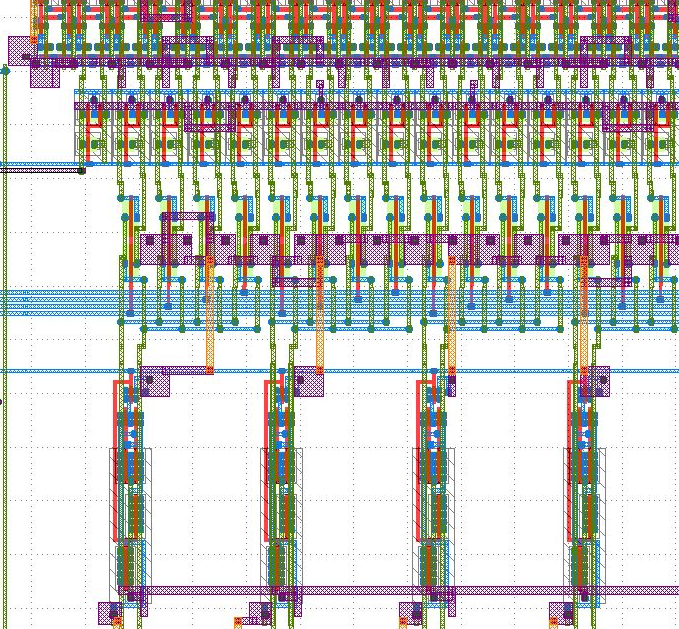
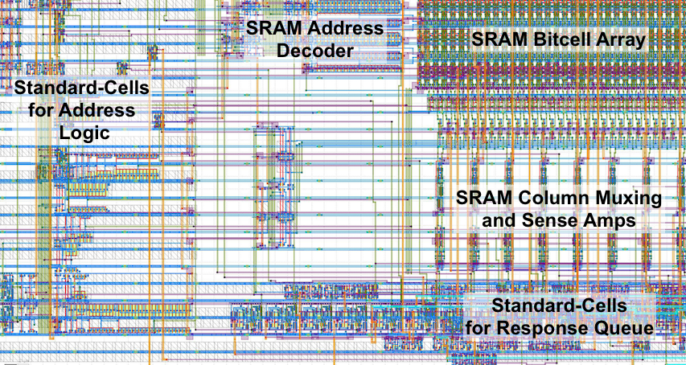

ECE 5745 Tutorial 8: SRAM Generators
==========================================================================

 - Author: Christopher Batten
 - Date: April 6, 2021

**Table of Contents**

 - Introduction
 - OpenRAM Memory Generator
 - Using SRAMs in RTL Models
 - Manual ASIC Flow with SRAM Macros
 - Automated ASIC Flow with SRAM Macros
 - Using Verilog RTL Models

Introduction
--------------------------------------------------------------------------

Small memories can be easily synthesized using flip-flop or latch
standard cells, but synthesizing large memories can significantly impact
the area, energy, and timing of the overall design. ASIC designers often
use SRAM generators to "generate" arrays of memory bitcells and the
corresponding peripheral circuitry (e.g., address decoders, bitline
drivers, sense amps) which are combined into what is called an "SRAM
macro". These SRAM generators are parameterized to enable generating a
wide range of SRAM macros with different numbers of rows, columns, and
column muxes, as well as optional support for partial writes, built-in
self-test, and error correction. Similar to a standard-cell library, an
SRAM generator must generate not just layout but also all of the
necessary views to capture logical functionality, timing, geometry, and
power usage. These views can then by used by the ASIC tools to produce a
complete design which includes a mix of both standard cells and SRAM
macros.

The tutorial will first describe how to use the open-source OpenRAM
memory generator to generate various views of an SRAM macro. You will
then see how to use an SRAM in an RTL model, how to generate the
corresponding SRAM macro, and then how to push a design which uses an
SRAM macro through the manual ASIC flow. Finally, you will see how to use
PyHFlow to automate this process. This tutorial assumes you have already
completed the tutorials on Linux, Git, PyMTL, Verilog, the
Synopsys/Cadence ASIC tools, and the PyHFlow automated ASIC flow.

The following diagram illustrates how the memory generator integrates
with the four primary tools covered in the previous tutorials. We run the
memory generator to generate various views which are then combined with
the standard cell views to create the complete library used in the ASIC
flow.


The first step is to source the setup script, clone this repository from
GitHub, and define an environment variable to keep track of the top
directory for the project.

```
 % source setup-ece5745.sh
 % mkdir -p $HOME/ece5745
 % cd $HOME/ece5745
 % git clone git@github.com:cornell-ece5745/ece5745-tut8-sram
 % cd ece5745-tut8-sram
 % TOPDIR=$PWD
```

OpenRAM Memory Generator
--------------------------------------------------------------------------

Just as with standard-cell libraries, acquiring real SRAM generators is a
complex and potentially expensive process. It requires gaining access to
a specific fabrication technology, negotiating with a company which makes
the SRAM generator, and usually signing multiple non-disclosure
agreements. The OpenRAM memory generator is based on the same "fake" 45nm
technology that we are using for the Nangate standard-cell library. The
"fake" technology is representative enough to provide reasonable area,
energy, and timing estimates for our purposes. In this section, we will
take a look at how to use the OpenRAM memory generator to generate
various views of an SRAM macro.

An SRAM generator takes as input a configuration file which specifies the
various parameters for the desired SRAM macro. You can see an example
configuration file for the OpenRAM memory generator here:

```
 % cd $TOPDIR/asic-manual/openram-mc
 % cat SRAM_32x128_1rw.py
 num_rw_ports    = 1
 num_r_ports     = 0
 num_w_ports     = 0

 word_size       = 32
 num_words       = 128
 num_banks       = 1
 words_per_row   = 4

 tech_name       = "freepdk45"
 process_corners = ["TT"]
 supply_voltages = [1.1]
 temperatures    = [25]

 route_supplies  = True
 check_lvsdrc    = True

 output_path     = "SRAM_32x128_1rw"
 output_name     = "SRAM_32x128_1rw"
 instance_name   = "SRAM_32x128_1rw"
```

In this example, we are generating a single-ported SRAM which has 128
rows and 32 bits per row for a total capacity of 4096 bits or 512B. This
size is probably near the cross-over point where you might transition
from using synthesized memories to SRAM macros. OpenRAM will take this
configuration file as input and generate many different views of the SRAM
macro including: schematics (`.sp`), layout (`.gds`), a Verilog
behavioral model (`.v`), abstract logical, timing, power view (`.lib`),
and a physical view (`.lef`). These views can then be used by the ASIC
tools.

You can use the following command to run the OpenRAM memory generator.

```
 % cd $TOPDIR/asic-manual/openram-mc
 % openram -v SRAM_32x128_1rw.py
```

It will take about 6-7 minutes to generate the SRAM macro. You can see
the resulting views here:

```
 % cd $TOPDIR/asic-manual/openram-mc/SRAM_32x128_1rw
 % ls -1
 SRAM_32x128_1rw.v
 SRAM_32x128_1rw.sp
 SRAM_32x128_1rw.gds
 SRAM_32x128_1rw.lef
 SRAM_32x128_1rw_TT_1p1V_25C.lib
 SRAM_32x128_1rw.html
```

You can find more information about the OpenRAM memory generator in this
recent research paper:

 - M. Guthaus et. al, "OpenRAM: An Open-Source Memory Compiler", Int'l
   Conf. on Computer-Aided Design (ICCAD), Nov. 2016.
   (https://doi.org/10.1145/2966986.2980098)

The following excerpt from the paper illustrates the microarchitecture
used in the single-port SRAM macro in the original OpenRAM implementation.


The functionality of the pins are as follows:

 - `clk`: clock
 - `WEb`: write enable (active low)
 - `OEb`: output enable (active low)
 - `CSb`: whole SRAM enable (active low)
 - `ADDR`: address
 - `DATA`: read/write data

Notice that there is a single address, and a single read/write data bus.
In the new version of OpenRAM that we are currently using, this has been
changed to use a separate read data and write data bus. However, this
SRAM macro still only supports executing a single transaction at a time.
The diagram shows a bank select which is used when a single SRAM macro is
built out of multiple lower-level "physical banks" to produce a more
efficient layout (by means of reducing the length of bitlines and
wordlines, hence improving delay and energy efficiency). To achieve
similar results, we instead use a column muxing factor, which allows us
to read multiple lines and select the data we want via a MUX, hence also
creating a more efficient layout. We will see what the column muxing
looks like a little later in the tutorial.

The following excerpt from the paper shows the timing diagram for a read
and write transaction in the old OpenRAM implementation, which for the
most part holds for the most recent version.


In order to execute any kind of transaction in the SRAM, we need to set
the `CSb` pin low (note that `CSb` is active low). Let's start by
focusing on the read transaction shown on the left. For the read
transaction on the left, the `WEb` pin is set high (note that `WEB` is
active low). The `ADDR` pins are used to set the row address. Note that
this is a _row_ address not a _byte_ address. From the block diagram, we
can see that the address first goes into the "Address MS-Flop". This is
an array of flip-flops which store the address on the rising edge of the
clock. After the rising edge, the address is decoded to drive the word
lines and enable the desired row. The read data is driven from the bit
cell array through the column muxing and into the sense amp array. The
`OEb` pin was used to determine whether the read data should be driven
onto the data bus. This can enable multiple SRAM macros to be arranged on
a distributed bus with only one SRAM driving that bus on any given cycle.
The `OEb` pin has since been removed in OpenRAM, and its functionality was
tied to the `CSb` pin. Assuming `CSb` is low, then the read data
is driven out the `DATA` pins. Since we set the address _before_ the
edge and the data is valid _after_ the edge, this is a
_synchronous_ read SRAM. Compare this to a register file which often
provides a _combinational_ read where the address is set and the data is
valid sometime later during the _same_ cycle. Most SRAM generators
produce synchronous read SRAM macros. For the write transaction on the
right, the `WEb` pin is set low and the `DATA` pins are driven with the
write data.

You can look at the behavioral Verilog produced by the OpenRAM memory
generator like this:

```
 % cd $TOPDIR/asic-manual/openram-mc/SRAM_32x128_1rw
 % less SRAM_32x128_1rw.v
 module SRAM_32x128_1rw(
   // Port 0: RW
   clk0,csb0,web0,addr0,din0,dout0
 );

   parameter DATA_WIDTH = 32;
   parameter ADDR_WIDTH = 7;
   parameter RAM_DEPTH  = 1 << ADDR_WIDTH;
   // FIXME: This delay is arbitrary.
   parameter DELAY      = 3;

   input                   clk0;  // clock
   input                   csb0;  // active low chip select
   input                   web0;  // active low write control
   input  [ADDR_WIDTH-1:0] addr0;
   input  [DATA_WIDTH-1:0] din0;
   output [DATA_WIDTH-1:0] dout0;

   reg                  csb0_reg;
   reg                  web0_reg;
   reg [ADDR_WIDTH-1:0] addr0_reg;
   reg [DATA_WIDTH-1:0] din0_reg;
   reg [DATA_WIDTH-1:0] dout0;

   // All inputs are registers
   always @(posedge clk0)
   begin
     csb0_reg  = csb0;
     web0_reg  = web0;
     addr0_reg = addr0;
     din0_reg  = din0;
     dout0     = 32'bx;
     if ( !csb0_reg && web0_reg )
       $display($time," Reading %m addr0=%b dout0=%b",addr0_reg,mem[addr0_reg]);
     if ( !csb0_reg && !web0_reg )
       $display($time," Writing %m addr0=%b din0=%b",addr0_reg,din0_reg);
   end

   reg [DATA_WIDTH-1:0] mem [0:RAM_DEPTH-1];

   // Memory Write Block Port 0
   // Write Operation : When web0 = 0, csb0 = 0
   always @ (negedge clk0)
   begin : MEM_WRITE0
     if ( !csb0_reg && !web0_reg )
       mem[addr0_reg] = din0_reg;
   end

   // Memory Read Block Port 0
   // Read Operation : When web0 = 1, csb0 = 0
   always @ (negedge clk0)
   begin : MEM_READ0
     if (!csb0_reg && web0_reg)
        dout0 <= #(DELAY) mem[addr0_reg];
   end

 endmodule
```

This is a simple behavior Verilog model which could be used for RTL
simulation. If you study this behavioral model you should be able to see
the timing diagrams it implements, and the slight variations from the
original OpenRAM implementation described in the paper. Again, notice
that the read operation is modeled using an `always @(negedge clk)` block
to reflect the fact that this SRAM uses a _sequential_ read based on the
clock.

You can take a look at the generated transistor-level netlist like this:

```
 % cd $TOPDIR/asic-manual/openram-mc/SRAM_32x128_1rw
 % less -p " cell_1rw " SRAM_32x128_1rw.sp
 .SUBCKT cell_1rw bl br wl vdd gnd
 * Inverter 1
 MM0 Q_bar Q gnd gnd NMOS_VTG W=205.00n L=50n
 MM4 Q_bar Q vdd vdd PMOS_VTG W=90n     L=50n

 * Inverter 2
 MM1 Q Q_bar gnd gnd NMOS_VTG W=205.00n L=50n
 MM5 Q Q_bar vdd vdd PMOS_VTG W=90n     L=50n

 * Access transistors
 MM3 bl wl Q gnd NMOS_VTG W=135.00n L=50n
 MM2 br wl Q_bar gnd NMOS_VTG W=135.00n L=50n
 .ENDS cell_1rw
```

This is showing the netlist for one bitcell in the SRAM. This is a
classic 6T SRAM bitcell with two cross-coupled inverters (`MM0`, `MM4`,
`MM1`, `MM5`) and two access transistors (`MM2`, `MM3`). Note that the
transistors must be carefully sized to ensure correct operation of an
SRAM bitcell!

Now let's use Klayout look at the actual layout produced by the OpenRAM
memory generator.

```
 % cd $TOPDIR/asic-manual/openram-mc/SRAM_32x128_1rw
 % klayout -l $ECE5745_STDCELLS/klayout.lyp SRAM_32x128_1rw.gds
```

The following figure shows the layout for the SRAM macro. In Klayout, you
can show/hide layers by double clicking on them on the right panel. You
can show more of the hierarchy by selecting _Display > Increment
Hierarchy_ from the menu.



To explain the circuitry in the SRAM, on the left we have flops for the
row addresses, which are then fed into a decoder. The decoder activates a
certain wordline driver, which will then read out the data through the
circuitry below (with the column muxing and sense amps shown in more
detail in the following image). Also note that in the above image, the
circuitry at the bottom are the flops for the read data.

Notice how at the bottom of the SRAM, above the data flops, we have
circuitry distributed every four rows of the SRAM. This is the column
muxing circuitry that we added in our configuration file and mentioned
previously. The following figure shows a closer look at this column
muxing circuitry and the sense amps.



The following figure shows the layout for a single SRAM bitcell.


The word line is routed horizontally on M1 (blue) and the bit lines are
routed vertically on M2 (green). It looks like power and ground are
routed both vertically and horizontally. See if you can map the layout to
the canonical 6T SRAM bitcell transistor-level implementation.

Let’s look at snippet of the `.lib` file for the SRAM macro.

```
 % cd $TOPDIR/asic-manual/openram-mc/SRAM_32x128_1rw/SRAM_32x128_1rw
 % less SRAM_32x128_1rw_TT_1p1V_25C.lib
 ...
 cell (SRAM_32x128_1rw) {
   ...
   area : 6967.660000000001;
   ...
   bus (dout0) {
     bus_type        : data;
     direction       : output;
     max_capacitance : 0.0008364000000000001;
     min_capacitance : 5.2275000000000003e-05;
     memory_read() {
       address : addr0;
     }
     pin(dout0[31:0]) {
       timing(){
         timing_sense : non_unate;
         related_pin  : "clk0";
         timing_type  : falling_edge;
         cell_rise(CELL_TABLE) {
           values("0.322, 0.323, 0.323",\
                  "0.322, 0.323, 0.323",\
                  "0.322, 0.323, 0.323");
         }
         cell_fall(CELL_TABLE) {
           values("0.322, 0.323, 0.323",\
                  "0.322, 0.323, 0.323",\
                  "0.322, 0.323, 0.323");
         }
         rise_transition(CELL_TABLE) {
           values("0.001, 0.001, 0.001",\
                  "0.001, 0.001, 0.001",\
                  "0.001, 0.001, 0.001");
         }
         fall_transition(CELL_TABLE) {
           values("0.001, 0.001, 0.001",\
                  "0.001, 0.001, 0.001",\
                  "0.001, 0.001, 0.001");
         }
       }
     }
   }
   ...
 }
```

As with the standard-cell library, the `.lib` includes information about
the area of the block, the capacitance on all pins, and power of the
circuit. By default OpenRAM will use analytical models to estimate this
characterization data which is probably why the timing values are not
varying too much within a look-up table. OpenRAM can also use SPICE
simulations to estimate this characterization data. These simulations
will result in the memory compiler taking significantly longer to
generate the SRAM macros, but will also result in much more accurate
characterization data.

The `.lef` file will mostly contain large rectangular blockages which
mean that the ASIC tools should not route any M1, M2, M3 wires over the
SRAM (because they would accidentally create short circuits with the M1,
M2, M3 wires already in the SRAM macro). The `.lef` file also identifies
where all of the pins are physically located so the ASIC tools can
correctly connect to the SRAM macro.

**To Do On Your Own:** Try experimenting with the configuration file to
generate other SRAM macros. For example, try generating an SRAM with the
same number of rows and bits per row but with a column muxing factor of
two (i.e., set `words_per_row` to 2).

Using SRAMs in RTL Models
--------------------------------------------------------------------------

Now that we understand how an SRAM generator works, let's see how to
actually use an SRAM in your RTL models. We have created a behavioral
SRAM model in the `sim/sram` subdirectory.

```
 % cd $TOPDIR/sim/sram
 % ls
 ...
 SramPRTL.py
 SramVRTL.v
 SramRTL.py
```

There is both a PyMTL and Verilog version. Both are parameterized by the
number of words and the bits per word, and both have the same pin-level
interface:

 - `port0_val`: port enable
 - `port0_type`: transaction type (0 = read, 1 = write)
 - `port0_idx`: which row to read/write
 - `port0_wdata`: write data
 - `port0_wben`: write byte enable
 - `port0_rdata`: read data

SRAMs use a latency _sensitive_ interface meaning a user must carefully
manage the timing for correct operation (i.e., set the read address and
then exactly one cycle later use the read data). In addition, the SRAM
cannot be "stalled". To illustrate how to use SRAM macros, we will create
a latency _insensitive_ val/rdy wrapper around an SRAM which enables
writing and reading the SRAM using our standard memory messages. The
following figure illustrates a naive approach to implementing the SRAM
val/rdy wrapper.


Consider what might happen if we use a single-element bypass queue. The
following pipeline diagram illustrates what can go wrong.

```
 cycle : 0  1  2  3  4  5  6  7  8
 msg a : M0 Mx
 msg b :    M0 Mx
 msg c :       M0 M1 M2 M2 M2       # M2 stalls on cycles 3-5
 msg d :          M0 M1 M1 M1 M2    # but wait, we cannot stall in M1!
 msg e :             M0 M0 M0 M0 Mx

 cycle M0 M1 [q] M2
    0: a
    1: b  a      a  # a flows through bypass queue
    2: c  b      b  # b flows through bypass queue
    3: d  c         # M2 is stalled, c will need to go into bypq
    4: e  d   c     # q is full at beginning of cycle, enq_rdy = 0
    5: e  ?   c     # what happens to d? cannot stall in M1!
```

Here we are using Mx to indicate when a transaction goes through M1 and
M2 in the same cycle because it flows straight through the bypass queue.
So on cycle 3, the response interface is stalled and as a consequence
message c must be enqueued into the memory response queue. On cycle 4,
the response queue is full (`recv_rdy` = 0) so `memreq_rdy` = 0 and
message e will stall in M0 (i.e., will stall waiting to be accepted by
the SRAM wrapper). The critical question is what happens to message d? It
_cannot_ stall in M1 because we cannot stall the SRAM. So basically we
just drop it. Increasing the amount of the buffering in the bypass queue
will not solve the problem. The key issue is that by the time we realize
the bypass queue is full we can potentially already have a transaction
executing in the SRAM, and this transaction cannot be stalled.

This is a classic situation where the need more skid buffering. A correct
solution will have two or more elements of buffering in the memory
response queue _and_ stall M0 if there are less than two free elements in
the queue. Thus in the worst case, if M2 stalls we have room for two
messages in the response queue: the message currently in M1 and the
message currently in M0. Here is the updated design:


Here is the updated pipeline diagram.

```
 cycle : 0  1  2  3  4  5  6  7  8
 msg a : M0 Mx
 msg b :    M0 Mx
 msg c :       M0 M1 M2 M2 M2
 msg d :          M0 M1 q  q  M2     # msg c is in skid buffer
 msg e :             M0 M0 M0 M0 Mx

 cycle M0 M1 [q ] M2
    0: a
    1: b  a       a  # a flows through bypass queue
    2: c  b       b  # b flows through bypass queue
    3: d  c          # M2 is stalled, c will need to go into bypq
    4: e  d    c     #
    5: e      dc     # d skids behind c into the bypq
    6: e       d  c  # c is dequeued from bypq
    7: e          d  # d is dequeued from bypq
    8:    e       e  # e flows through bypass queue
```

Note, with a pipe queue you still need two elements of buffering. There
could be a message in the response queue when M2 stalls and then you
still don't have anywhere to put the message currently in M1.

Take a closer look at the SRAM val/rdy wrapper we provide you. Here is
the PyMTL version:

```
 % cd $TOPDIR/sim/tut8_sram
 % more SramMinionPRTL.py
 from sram import SramRTL
 ...
 s.sram = m = SramRTL( num_bits, num_words )
```

And here is the Verilog version:

```
 % cd $TOPDIR/sim/tut8_sram
 % more SramMinionVRTL.v
 `include "sram/SramVRTL.v"
 ...
 sram_SramVRTL#(32,128) sram
  (
    .clk         (clk),
    .reset       (reset),
    .port0_idx   (sram_addr_M0),
    .port0_type  (sram_wen_M0),
    .port0_val   (sram_en_M0),
    .port0_wdata (memreq_msg_data_M0),
    .port0_rdata (sram_read_data_M1)
  );
```

To use an SRAM in a PyMTL model, simply import `SramRTL`, instantiate the
SRAM, and set the number of words and number of bits per word. To use an
SRAM in a Verilog model, simply include `sram/SramVRTL.v` and again
instantiate the SRAM, and set the number of words and number of bits per
word.

We can run a test on the SRAM val/rdy wrapper like this:

```
 % mkdir -p $TOPDIR/sim/build
 % cd $TOPDIR/sim/build
 % pytest ../tut8_sram/test/SramMinionRTL_test.py -k random_0_3 -s
 ...
  3:                           > ( ) > .
  4: wr:00:00000000:0:55fceed9 > ( ) > .
  5: wr:01:00000004:0:5bec8a7b > (*) > #
  6: #                         > (*) > #
  7: #                         > ( ) > wr:00:0:0:
  8: #                         > ( ) > #
  9: #                         > ( ) > #
 10: #                         > ( ) > #
 11: #                         > ( ) > wr:01:0:0:
 12: wr:02:00000008:0:b1aa20f1 > ( ) > .
 13: wr:03:0000000c:0:a5b6b6bb > (*) > #
 14: #                         > (*) > #
 15: #                         > ( ) > wr:02:0:0:
 16: #                         > ( ) > #
 17: #                         > ( ) > #
 18: #                         > ( ) > #
 19: #                         > ( ) > wr:03:0:0:
```

The first write transaction takes a single cycle to go through the SRAM
val/rdy wrapper (and is held up in the SRAM), but the SRAM response
interface is not ready on cycles 5-7. The second and third write
transactions are still accepted by the SRAM val/rdy wrapper and they will
end up in the bypass queue, but the fourth write transaction is stalled
because the request interface is not ready. No transactions are lost.

The SRAM module is parameterized to enable initial design space
exploration, but just because we choose a specific SRAM configuration
does not mean the files we need to create the corresponding SRAM macro
exist yet. Once we have finalized the SRAM size, we need to go through a
four step process.

**Step 1: See if SRAM configuration already exists**

The first step is to see if your desired SRAM configuration already
exists. You can do this by looking at the names of the `-cfg.py` files in
the `sim/sram` subdirectory.

```
 % cd $TOPDIR/sram
 % ls *-cfg.py
 SRAM_128x256_1rw-cfg.py
 SRAM_32x256_1rw-cfg.py
```

This means there are two SRAM configurations already available. One SRAM
has 256 words each with 128 bits and the other SRAM has 256 words each
with 32 bits. If the SRAM configuration you need already exists then you
are done and can skip the remaining steps.

**Step 2: Create SRAM configuration file**

The next step is to create a new SRAM configuration file. You must use a
very specific naming scheme. An SRAM with `N` words and `M` bits per word
must be named `SRAM_MxN_1rw-cfg.py`. Create a configuration file named
`SRAM_32x128_1rw-cfg.py` that we can use in the SRAM val/rdy wrapper. The
configuration file should contain the following contents:

```
 % cd $TOPDIR/sram
 % more SRAM_32x128_1rw-cfg.py
 num_rw_ports    = 1
 num_r_ports     = 0
 num_w_ports     = 0

 word_size       = 32
 num_words       = 128
 num_banks       = 1
 words_per_row   = 4

 tech_name       = "freepdk45"
 process_corners = ["TT"]
 supply_voltages = [1.1]
 temperatures    = [25]

 route_supplies  = True
 check_lvsdrc    = True

 output_path     = "SRAM_32x128_1rw"
 output_name     = "SRAM_32x128_1rw"
 instance_name   = "SRAM_32x128_1rw"
```

**Step 3: Create an SRAM configuration RTL model**

The next step is to create an SRAM configuration RTL model. This new RTL
model should have the same name as the configuration file except a PyMTL
RTL model should use a `.py` filename extension and a Verilog RTL model
should use a `.v` filename extension. We have provided a generic SRAM RTL
model to make it easier to implement the SRAM configuration RTL model.
The generic PyMTL SRAM RTL model is in `SramGenericPRTL.py` and the
generic Verilog SRAM RTL model is in `SramGenericVRTL.v`. Go ahead and
create an SRAM configuration RTL model for the 32x128 configuration that
we used in the SRAM val/rdy wrapper.

Here is what the base SRAM model should look like if you are using PyMTL:

```python
from pymtl3                         import *
from pymtl3.passes.backends.verilog import *
from .SramGenericPRTL               import SramGenericPRTL

class BaseSRAM1rw( Component ):

  # Make sure widths match the .v

  def construct( s, data_nbits, num_entries ):

    # clock (in PyMTL simulation it uses implict .clk port when
    # translated to Verilog, actual clock ports should be CE1

    s.clk0  = InPort () # clk
    s.web0  = InPort () # bar( write en )
    s.csb0  = InPort () # bar( whole SRAM en )
    s.addr0 = InPort ( clog2(num_entries) ) # address
    s.din0  = InPort ( data_nbits ) # write data
    s.dout0 = OutPort( data_nbits ) # read data

    # This is a blackbox that shouldn't be translated

    s.set_metadata( VerilogTranslationPass.no_synthesis,          True )
    s.set_metadata( VerilogTranslationPass.no_synthesis_no_clk,   True )
    s.set_metadata( VerilogTranslationPass.no_synthesis_no_reset, True )
    s.set_metadata( VerilogTranslationPass.explicit_module_name,  f'SRAM_{data_nbits}x{num_entries}_1rw' )

    # instantiate a generic sram inside

    s.sram_generic = m = SramGenericPRTL( data_nbits, num_entries )
    m.clk0  //= s.clk0
    m.web0  //= s.web0
    m.csb0  //= s.csb0
    m.addr0 //= s.addr0
    m.din0  //= s.din0
    m.dout0 //= s.dout0
```

Notice how this is simply a wrapper around `SramGenericPRTL` instantiated
with the desired number of words and bits per word. A specific instance of
this wrapper can be instantiated as follows:

```python
from pymtl3                         import *
from pymtl3.passes.backends.verilog import *
from .BaseSRAM1rw                   import BaseSRAM1rw

class SRAM_32x128_1rw( BaseSRAM1rw ):

  # Make sure widths match the .v

  def construct( s ):
    super().construct( 32, 128 )
```

Here is what this model should look like if you are using Verilog:

```verilog
`ifndef SRAM_32x128_1rw
`define SRAM_32x128_1rw

`include "sram/SramGenericVRTL.v"

`ifndef SYNTHESIS

module SRAM_32x128_1rw
(
  input  logic        clk0,
  input  logic        web0,
  input  logic        csb0,
  input  logic [7:0]  addr0,
  input  logic [31:0] din0,
  output logic [31:0] dout0
);

  sram_SramGenericVRTL
  #(
    .p_data_nbits  (32),
    .p_num_entries (128)
  )
  sram_generic
  (
    .clk0  (clk0),
    .addr0 (addr0),
    .web0  (web0),
    .csb0  (csb0),
    .din0  (din0),
    .dout0 (dout0)
  );

endmodule

`endif /* SYNTHESIS */

`endif /* SRAM_32x128_1rw */
```

Notice how this is simply a wrapper around `SramGenericVRTL` instantiated
with the desired number of words and bits per word.

**Step 3: Use new SRAM configuration RTL model in top-level SRAM model**

The final step is to modify the top-level SRAM model to select the proper
SRAM configuration RTL model. If you are using PyMTL, you will need to
modify `SramPRTL.py` like this:

```python
# Add this at the top of the file
from .SRAM_32x128_1rw  import SRAM_32x128_1rw

...

   if   num_bits == 32 and num_words == 256:
      s.sram = m = SRAM_32x256_1P()
      ...

    # Add the following to choose new SRAM configuration RTL model and hook up connections
    elif data_nbits == 32 and num_entries == 128:
        s.sram = m = SRAM_32x128_1rw()
        ...

    else:
      s.sram = m = SramGenericPRTL( num_bits, num_words )
      ...
```

If you are using Verilog, you will need to modify `SramVRTL.v` like this:

```verilog
// Add this at the top of the file
`include "sram/SRAM_32x128_1rw.v"

...

  generate
    if      ( p_data_nbits == 32  && p_num_entries == 256 ) SRAM_32x256_1rw  sram (.*);
    else if ( p_data_nbits == 128 && p_num_entries == 256 ) SRAM_128x256_1rw sram (.*);
    else if ( p_data_nbits == 32  && p_num_entries == 128 ) SRAM_32x128_1rw  sram (.*);
    else
      sram_SramGenericVRTL#(p_data_nbits,p_num_entries) sram (.*);
  endgenerate
```

One might ask what is the point of going through all of the trouble of
creating an SRAM configuration RTL model that is for a specific size if
we already have a generic SRAM RTL model. The key reason is that the ASIC
tools will use the _name_ of the SRAM to figure out where to swap in the
SRAM macro. So we need a explicit module name for every different SRAM
configuration to enable using SRAM macros in the ASIC tools.

**Step 4: Test new SRAM configuration**

The final step is to test the new configuration and verify everything
works. We start by adding a simple directed test to the `SramRTL_test.py`
test script. Here is an example:

```python
def test_direct_32x128( cmdline_opts ):
  run_test_vector_sim( SramRTL(32, 128), [ header_str,
    # val type idx  wdata   rdata
    [ 1,  1,  0x00, 0x00000000, '?'        ], # one at a time
    [ 1,  0,  0x00, 0x00000000, '?'        ],
    [ 0,  0,  0x00, 0x00000000, 0x00000000 ],
    [ 1,  1,  0x00, 0xdeadbeef, '?'        ],
    [ 1,  0,  0x00, 0x00000000, '?'        ],
    [ 0,  0,  0x00, 0x00000000, 0xdeadbeef ],
    [ 1,  1,  0x01, 0xcafecafe, '?'        ],
    [ 1,  0,  0x01, 0x00000000, '?'        ],
    [ 0,  0,  0x00, 0x00000000, 0xcafecafe ],
    [ 1,  1,  0x1f, 0x0a0a0a0a, '?'        ],
    [ 1,  0,  0x1f, 0x00000000, '?'        ],
    [ 0,  0,  0x00, 0x00000000, 0x0a0a0a0a ],

    [ 1,  1,  0x1e, 0x0b0b0b0b, '?'        ], # streaming reads
    [ 1,  0,  0x1e, 0x00000000, '?'        ],
    [ 1,  0,  0x1f, 0x00000000, 0x0b0b0b0b ],
    [ 1,  0,  0x01, 0x00000000, 0x0a0a0a0a ],
    [ 1,  0,  0x00, 0x00000000, 0xcafecafe ],
    [ 0,  0,  0x00, 0x00000000, 0xdeadbeef ],

    [ 1,  1,  0x1d, 0x0c0c0c0c, '?'        ], # streaming writes/reads
    [ 1,  0,  0x1d, 0x00000000, '?'        ],
    [ 1,  1,  0x1c, 0x0d0d0d0d, 0x0c0c0c0c ],
    [ 1,  0,  0x1c, 0x00000000, '?'        ],
    [ 1,  1,  0x1b, 0x0e0e0e0e, 0x0d0d0d0d ],
    [ 1,  0,  0x1b, 0x00000000, '?'        ],
    [ 0,  0,  0x00, 0x00000000, 0x0e0e0e0e ],
  ], cmdline_opts )
```

This directed test writes a value to a specific word and then reads that
word to verify the value was written correctly. We test writing the first
word, the last word, and other words. We can run the directed test like this:

```
 % cd $TOPDIR/sim/build
 % pytest ../sram/test/SramRTL_test.py -k test_direct_32x128
```

We have included a helper function that simplifies random testing. All
you need to do is add the configuration to the `sram_configs` variable in
the test script:

```
 sram_configs = [ (16, 32), (32, 128), (32, 256), (128, 256) ]
```

Then you can run the random test like this:

```
 % cd $TOPDIR/sim/build
 % pytest ../sram/test/SramRTL_test.py -k test_random[32-128]
```

And of course we should run all of the tests to ensure we haven't broken
anything when adding this new configuration.

```
 % cd $TOPDIR/sim/build
 % pytest ../sram
```

Manual ASIC Flow with SRAM Macros
--------------------------------------------------------------------------

Now that we have added the desired SRAM configuration, we can use the
ASIC tools to generate layout for the SRAM val/rdy wrapper. In this
section, we will go through the steps manually, and in the next section
we will use the automated ASIC flow.

The first step is to run a simulator to generate the Verilog for pushing
through the flow.

```
 % cd $TOPDIR/sim/build
 % ../tut8_sram/sram-sim --impl rtl --input random --translate --dump-vcd
 % ls
 ...
 SramMinionRTL__pickled.v
```

As you can see, the simulator will generate a Verilog file
`SramMinionRTL__pickled.v` which is what we use with the ASIC tools.

The next step is to run the OpenRAM memory generator to generate the
SRAM macro corresponding to the desired 32x128 configuration.

```
 % mkdir -p $TOPDIR/asic-manual/openram-mc
 % cd $TOPDIR/asic-manual/openram-mc
 % openram -v ../../sim/sram/SRAM_32x128_1rw-cfg.py
 % cd SRAM_32x128_1rw
 % mv *.lib *.lef *.gds *.v ..
```

We need to convert the `.lib` file into a `.db` file using the
Synopsys Library Compiler (LC) tool.

```
% cd $TOPDIR/asic-manual/openram-mc
% cp SRAM_32x128_1rw_TT_1p1V_25C.lib SRAM_32x128_1rw.lib
% lc_shell
lc_shell> read_lib SRAM_32x128_1rw.lib
lc_shell> write_lib SRAM_32x128_1rw_TT_1p1V_25C_lib -format db -output SRAM_32x128_1rw.db
lc_shell> exit
```

Check that the `.db` file now exists.
```
% cd $TOPDIR/asic-manual/openram-mc
% ls
...
SRAM_32x128_1rw.db
```

Now we can use Synopsys DC to synthesize the logic which goes around the
SRAM macro.

```
 % mkdir -p $TOPDIR/asic-manual/synopsys-dc
 % cd $TOPDIR/asic-manual/synopsys-dc
 % dc_shell-xg-t

 dc_shell> set_app_var target_library "$env(ECE5745_STDCELLS)/stdcells.db ../openram-mc/SRAM_32x128_1rw.db"
 dc_shell> set_app_var link_library   "* $env(ECE5745_STDCELLS)/stdcells.db ../openram-mc/SRAM_32x128_1rw.db"
 dc_shell> analyze -format sverilog ../../sim/build/SramMinionRTL__pickled.v
 dc_shell> elaborate SramMinionRTL
 dc_shell> check_design
 dc_shell> create_clock clk -name ideal_clock1 -period 1.0
 dc_shell> compile
 dc_shell> write -format verilog -hierarchy -output post-synth.v
 dc_shell> exit
```

We are basically using the same steps we used in the Synopsys/Cadence
ASIC tool tutorial. Notice how we must point Synopsys DC to the `.db`
file generated by OpenRAM so Synopsys DC knows the abstract logical,
timing, power view of the SRAM.

If you look for the SRAM module in the synthesized gate-level netlist,
you will see that it is referenced but not declared. This is what we
expect since we are not synthesizing the memory but instead using an SRAM
macro.

```
 % cd $TOPDIR/asic-manual/synopsys-dc
 % less -p SRAM post-synth.v
```

Now we can use Cadence Innovus to place the SRAM macro and the standard
cells, and then automatically route everything together. We will be
running Cadence Innovus in a separate directory to keep the files
separate from the other tools.

```
 % mkdir -p $TOPDIR/asic-manual/cadence-innovus
 % cd $TOPDIR/asic-manual/cadence-innovus
```

As in the Synopsys/Cadence ASIC tool tutorial, we need to create two
files before starting Cadence Innovus. Use your favorite text editor to
create a file named `constraints.sdc`in
`$TOPDIR/asic-manual/cadence-innovus` with the following content:

```
 create_clock clk -name ideal_clock -period 1.0
```

Now use your favorite text editor to create a file named
`setup-timing.tcl` in `$TOPDIR/asic-manual/cadence-innovus` with the
following content:

```
 create_rc_corner -name typical \
    -cap_table "$env(ECE5745_STDCELLS)/rtk-typical.captable" \
    -T 25

 create_library_set -name libs_typical \
    -timing [list "$env(ECE5745_STDCELLS)/stdcells.lib" "../openram-mc/SRAM_32x128_1rw.lib"]

 create_delay_corner -name delay_default \
    -early_library_set libs_typical \
    -late_library_set libs_typical \
    -rc_corner typical

 create_constraint_mode -name constraints_default \
    -sdc_files [list constraints.sdc]

 create_analysis_view -name analysis_default \
    -constraint_mode constraints_default \
    -delay_corner delay_default

 set_analysis_view \
    -setup [list analysis_default] \
    -hold [list analysis_default]
```

This is very similar to the steps we used in the Synopsys/Cadence ASIC
tool tutorial, except that we have to include the `.lib` file generated
by OpenRAM. Now let's start Cadence Innovus, load in the design, and
complete the power routing just as in the Synopsys/Cadence ASIC tool
tutorial.

```
 % cd $TOPDIR/asic-manual/cadence-innovus
 % innovus -64
 innovus> set init_mmmc_file "setup-timing.tcl"
 innovus> set init_verilog   "../synopsys-dc/post-synth.v"
 innovus> set init_top_cell  "SramMinionRTL"
 innovus> set init_lef_file  "$env(ECE5745_STDCELLS)/rtk-tech.lef \
                              $env(ECE5745_STDCELLS)/stdcells.lef \
                              ../openram-mc/SRAM_32x128_1rw.lef"
 innovus> set init_gnd_net   "VSS"
 innovus> set init_pwr_net   "VDD"
 innovus> init_design
 innovus> floorPlan -r 0.60 0.65 4.0 4.0 4.0 4.0
 innovus> globalNetConnect VDD -type pgpin -pin VDD -inst * -verbose
 innovus> globalNetConnect VSS -type pgpin -pin VSS -inst * -verbose
 innovus> sroute -nets {VDD VSS}

 innovus> addRing -nets {VDD VSS} -width 0.6 -spacing 0.5 \
           -layer [list top 7 bottom 7 left 6 right 6]

 innovus> addStripe -nets {VSS VDD} -layer 6 -direction vertical \
           -width 0.4 -spacing 0.5 -set_to_set_distance 5 -start 0.5

 innovus> addStripe -nets {VSS VDD} -layer 7 -direction horizontal \
           -width 0.4 -spacing 0.5 -set_to_set_distance 5 -start 0.5
```

The following screen capture illustrates what you should see: a
rectangular floorplan with a power grid.


We can now do a simple placement and routing of the standard cells _and_
the SRAM macro in the floorplan, and then we can finalize the clock and
signal routing and add filler cells.

```
 innovus> place_design
 innovus> ccopt_design
 innovus> routeDesign
 innovus> setFillerMode -corePrefix FILL -core "FILLCELL_X4 FILLCELL_X2 FILLCELL_X1"
 innovus> addFiller
 innovus> report_timing
 innovus> streamOut post-par.gds \
          -merge "$env(ECE5745_STDCELLS)/stdcells.gds \
                  ../openram-mc/SRAM_32x128_1rw.gds" \
          -mapFile "$env(ECE5745_STDCELLS)/rtk-stream-out.map"
```

The following screen capture illustrates what you should see. The SRAM
macro is the large rectangle in the center of the floorplan. The
power grid has been hidden to make it easier to see the SRAM macro.


Cadence Innovus automatically placed the SRAM macro in the center and then
arranged the standard cells in rows around the SRAM macro. The tool has
automatically routed all of the signals between the standard cells and
the SRAM macro pins. The following screen capture shows a closer look
at some signal routing.


Notice how Cadence Innovus has used larger wires on higher metal layers
to do some of the global routing to and from the SRAM macro. The
following screen capture shows using _Windows > Workspaces > Design
Browser + Physical_ to highlight the memory response queue in red.


Let's go ahead and exit Innovus.

```
 innovus> exit
```

And now we can use Klayout to look at the final integrated layout.

```
 % cd $TOPDIR/asic-manual/cadence-innovus
 % klayout -l $ECE5745_STDCELLS/klayout.lyp post-par.gds
```

The following shows a portion of the final layout. We can see the SRAM
bitcell array in the upper right-hand corner along with the SRAM address
decoder and SRAM column muxing and sense amps. We can also see the
standard-cells used for address logic on the left where they connect to
the address pins of the SRAM, and the standard-cells used for the
response queue at the bottom where they connect to the data pins of the
SRAM.



Automated ASIC Flow with SRAM Macros
--------------------------------------------------------------------------

Obviously entering commands manually for each tool is very tedious and
error prone. We can use PyHFlow to automate the process of using OpenRAM
and then pushing designs through the flow that use SRAMs. The first step
is to make sure we have used the simulator to generate the Verilog and
VCD file that we want to use with the ASIC flow.

```
 % cd $TOPDIR/sim/build
 % ../tut8_sram/sram-sim --impl rtl --input random --translate --dump-vcd
 % ls
 ...
 SramMinionRTL__pickled.v
 sram-rtl-random.verilator1.vcd
```

We have provided a `flow.py` script that you can use. So all we need to
do is create a build directory and then use PyHFlow to configure the
flow.

```
 % mkdir -p $TOPDIR/asic/build-tut8-sram
 % cd $TOPDIR/asic/build-tut8-sram
 % pyhflow configure ../flow_tut8_sram.py
 % pyhflow info block

  - step: block
    - metadata:
      - clk_period: 2.0
      - input_delay_ratio: 0.2
      - output_delay_ratio: 0.1
      - top_name: SramMinionRTL
      - vcd_files: ['sram-rtl-random.verilator1.vcd']

 % pyhflow info memgen

  - step: memgen
    - metadata:
      - inst_name: SRAM_32x128_1rw
      - num_words: 128
      - word_size: 32
      - words_per_row: 4

 % pyhflow visualize
```

The PyHFlow `visualize` command will generate a PDF that visualizes the
configured flow. Here is what the flow looks like for this tutorial:


We can see a new `memgen` step which will use OpenRAM to create an SRAM
which is then used as an input to the `synth` and `pnr` steps. Now that
we have the flow configured we can actually run each step:

```
 % cd $TOPDIR/asic/build-tut8-sram
 % pyhflow run memgen
 % pyhflow run synth
 % pyhflow run pnr
 % pyhflow run pwr
 % pyhflow run summary
```

Or of course we can also do all of this with one command:

```
 % cd $TOPDIR/asic/build-tut8-sram
 % pyhflow run
```

And then we can open up the results in Cadence Innovus.

```
 % cd $TOPDIR/asic/build-tut8-sram/pnr
 % innovus -64
 innovus> source save.enc
```

You should see a placed-and-routed design very similar to what we
produced using the manual flow.

Using Verilog RTL Models
--------------------------------------------------------------------------

Students are of course welcome to use Verilog instead of PyMTL3 to design
their RTL models. To experiment with Verilog SRAMs, change `rtl_language`
in `SramMinionRTL` to `verilog`. Then following commands will run all of
the tests on the _Verilog_ implementation of the SRAM val/rdy wrapper:

```
 % rm -rf $TOPDIR/sim/build
 % mkdir -p $TOPDIR/sim/build
 % cd $TOPDIR/sim/build
 % pytest ../tut8_sram
```

We can run the SRAM simulator, but now we will be running it using the
_Verilog_ implementation of the SRAM val/rdy wrapper:

```
 % cd $TOPDIR/sim/build
 % ../tut8_sram/sram-sim --impl rtl --input random --translate --dump-vcd
 % ls
 ...
 SramMinionRTL__pickled.v
 sram-rtl-random.verilator1.vcd
```

Now we can use the manual ASIC flow steps, or we can also just use
PyHFlow to push the Verilog version of the val/rdy wrapper through the
flow.

```
 % rm -rf $TOPDIR/asic/build-tut8-sram
 % mkdir -p $TOPDIR/asic/build-tut8-sram
 % cd $TOPDIR/asic/build-tut8-sram
 % pyhflow configure ../flow_tut8_sram.py
 % pyhflow run
```

