ECE 5745 Tutorial 8: SRAM Generators
==========================================================================

 - Author: Christopher Batten
 - Date: March 3, 2019

**Table of Contents**

 - Introduction
 - OpenRAM Memory Generator
 - CACTI Memory Generator
 - Using SRAMs in RTL Models
 - Manual ASIC Flow with SRAM Macros
 - Automated ASIC Flow with SRAM Macros

Introduction
--------------------------------------------------------------------------

Small memories can be easily synthesized using flip-flop or latch
standard cells, but synthesizing large memories can significantly impact
the area, energy, and timing of the overall design. ASIC designers often
use SRAM generators to "generate" arrays of memory bitcells and the
corresponding peripheral circuitry (e.g., address decoders, bitline
drivers, sense amps) which are combined into what is called an "SRAM
macro". These SRAM generators are parameterized to enable generating a
wide range of SRAM macros with different numbers of rows, columns, and
column muxes, as well as optional support for partial writes, built-in
self-test, and error correction. Similar to a standard-cell library, an
SRAM generator must generate not just layout but also all of the
necessary views to capture logical functionality, timing, geometry, and
power usage. These views can then by used by the ASIC tools to produce a
complete design which includes a mix of both standard cells and SRAM
macros.

The tutorial will first describe how to use the open-source OpenRAM
memory generator to generate various views of an SRAM macro.
Unfortunately, the OpenRAM memory generator does not currently have
support for partial writes. In ECE 5745, we need to use macros with
partial writes, so we have created a different memory generator based on
the CACTI memory modeling tool. After learning about both the OpenRAM and
CACTI memory generators, you will see how to use an SRAM in an RTL model,
how to generate the corresponding SRAM macro, and then how to push a
design which uses an SRAM macro through the automated ASIC flow. This
tutorial assumes you have already completed the tutorials on Linux, Git,
PyMTL, Verilog, the Synopsys/Cadence ASIC tools, and the automated ASIC
flow.

The following diagram illustrates how the memory generator integrates
with the four primary tools covered in the previous tutorials. We run the
memory generator to generate various views which are then combined with
the standard cell views to create the complete library used in the ASIC
flow.

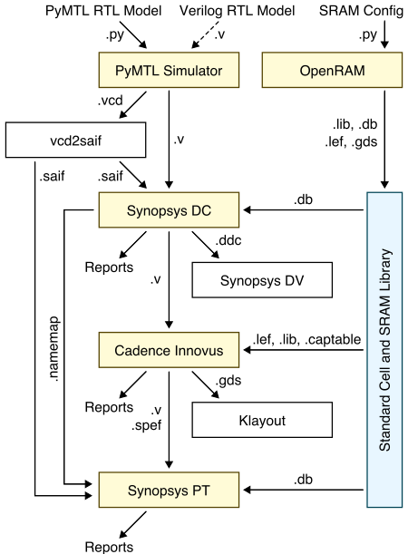

The first step is to source the setup script, clone this repository from
GitHub, and define an environment variable to keep track of the top
directory for the project.

```
 % source setup-ece5745.sh
 % mkdir $HOME/ece5745
 % cd $HOME/ece5745
 % git clone git@github.com:cornell-ece5745/ece5745-tut8-sram
 % cd ece5745-tut8-sram
 % TOPDIR=$PWD
```

OpenRAM Memory Generator
--------------------------------------------------------------------------

Just as with standard-cell libraries, acquiring real SRAM generators is a
complex and potentially expensive process. It requires gaining access to
a specific fabrication technology, negotiating with a company which makes
the SRAM generator, and usually signing multiple non-disclosure
agreements. The OpenRAM memory generator is based on the same "fake" 45nm
technology that we are using for the Nangate standard-cell library. The
"fake" technology is representative enough to provide reasonable area,
energy, and timing estimates for our purposes. In this section, we will
take a look at how to use the OpenRAM memory generator to generate
various views of an SRAM macro.

An SRAM generator takes as input a configuration file which specifies the
various parameters for the desired SRAM macro. You can see an example
configuration file for the OpenRAM memory generator here:

```
 % cd $TOPDIR/asic-manual/openram-mc
 % more SRAM_64x64_1P.cfg
 word_size = 64
 num_words = 64
 num_banks = 4
 tech_name = "freepdk45"
 process_corners = ["TT"]
 supply_voltages = [ 1.1 ]
 temperatures = [ 25 ]
 output_path = "SRAM_64x64_1P"
 output_name = "SRAM_64x64_1P"
```

In this example, we are generating a single-ported SRAM which has 64 rows
and 64 bits per row for a total capacity of 4096 bits or 512B. This size
is probably near the cross-over point where you might transition from
using synthesized memories to SRAM macros. OpenRAM will take this
configuration file as input and generate many different views of the SRAM
macro including: schematics (`.sp`), layout (`.gds`), a Verilog
behavioral model (`.v`), abstract logical, timing, power view (`.lib`),
and a physical view (`.lef`). These views can then be used by the ASIC
tools.

You can use the following command to run the OpenRAM memory generator.

```
 % cd $TOPDIR/asic-manual/openram-mc
 % openram -v SRAM_64x64_1P.cfg
```

It will take a few minutes to generate the SRAM macro. You can see the
resulting views here:

```
 % cd $TOPDIR/asic-manual/cati-mc/SRAM_64x64_1P
 % ls -1
 SRAM_64x64_1P.v
 SRAM_64x64_1P.sp
 SRAM_64x64_1P.gds
 SRAM_64x64_1P.lef
 SRAM_64x64_1P_TT_1p1V_25C.lib
```

You can find more information about the OpenRAM memory generator in this
recent research paper:

 - M. Guthaus et. al, "OpenRAM: An Open-Source Memory Compiler", Int'l
   Conf. on Computer-Aided Design (ICCAD), Nov. 2016.
   (https://doi.org/10.1145/2966986.2980098)

The following excerpt from the paper illustrates the microarchitecture
used in the single-port SRAM macro.


The functionality of the pins are as follows:

 - `clk`: clock
 - `WEb`: write enable (active low)
 - `OEb`: output enable (active low)
 - `CSb`: whole SRAM enable (active low)
 - `ADDR`: address
 - `DATA`: read/write data

Notice that there is a single address, and a single read/write data bus.
This SRAM macro has a single read/write port and only supports executing
a single transaction at a time. The diagram shows a bank select which is
used when a single SRAM macro is built out of multiple lower-level
"physical banks" to produce a more efficient layout. We will see what
these physical banks look like a little later in the tutorial.

The following excerpt from the paper shows the timing diagram for a read
and write transaction.

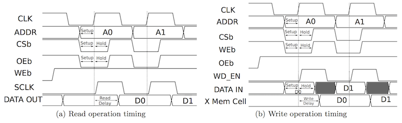

In order to execute any kind of transaction in the SRAM, we need to set
the `CSb` pin low (note that `CSb` is active low). Let's start by
focusing on the read transaction shown on the left. For the read
transaction on the left, the `WEb` pin is set high (note that `WEB` is
active low). The `ADDR` pins are used to set the row address. Note that
this is a _row_ address not a _byte_ address. From the block diagram, we
can see that the address first goes into the "Address MS-Flop". This is
an array of flip-flops which store the address on the rising edge of the
clock. After the rising edge, the address is decoded to drive the word
lines and enable the desired row. The read data is driven from the bit
cell array through the column muxing and into the sense amp array. The
`OEb` pin is used to determine whether the read data should be driven
onto the data bus. This can enable multiple SRAM macros to be arranged on
a distributed bus with only one SRAM driving that bus on any given cycle.
Assuming `OEb` is low (note that `OEb` is active low), then the read data
is driven out the `DATA` pins. Since we set the address _before_ the
rising edge and the data is valid _after_ the rising edge, this is a
_synchronous_ read SRAM. Compare this to a register file which often
provides a _combinational_ read where the address is set and the data is
valid sometime later during the _same_ cycle. Most SRAM generators
produce synchronous read SRAM macros. For the write transaction on the
right, the `WEb` pin is set low and the `DATA` pins are driven with the
write data.

You can look at the behavioral Verilog produced by the OpenRAM memory
generator like this:

```
 % cd $TOPDIR/asic-manual/openram-mc/SRAM_64x64_1P
 % less SRAM_64x64_1P.v
 module SRAM_64x64_1P(DATA,ADDR,CSb,WEb,OEb,clk);

   parameter DATA_WIDTH = 64 ;
   parameter ADDR_WIDTH = 6 ;
   parameter RAM_DEPTH = 1 << ADDR_WIDTH;
   parameter DELAY = 3 ;

   inout [DATA_WIDTH-1:0] DATA;
   input [ADDR_WIDTH-1:0] ADDR;
   input CSb;             // active low chip select
   input WEb;             // active low write control
   input OEb;             // active output enable
   input clk;             // clock

   reg [DATA_WIDTH-1:0] data_out ;
   reg [DATA_WIDTH-1:0] mem [0:RAM_DEPTH-1];

   // Tri-State Buffer control
   // output : When WEb = 1, oeb = 0, csb = 0
   assign DATA = (!CSb && !OEb && WEb) ? data_out : 64'bz;

   // Memory Write Block
   // Write Operation : When WEb = 0, CSb = 0
   always @ (posedge clk)
   begin : MEM_WRITE
   if ( !CSb && !WEb ) begin
     mem[ADDR] = DATA;
     $display($time," Writing %m ABUS=%b DATA=%b",ADDR,DATA);
     end
   end

   // Memory Read Block
   // Read Operation : When WEb = 1, CSb = 0
   always @ (posedge clk)
   begin : MEM_READ
   if (!CSb && WEb) begin
     data_out <= #(DELAY) mem[ADDR];
     $display($time," Reading %m ABUS=%b DATA=%b",ADDR,mem[ADDR]);
     end
   end

 endmodule
```

This is a simple behavior Verilog model which could be used for RTL
simulation. If you study this behavioral model you should be able to see
how it implements the timing diagrams shown above. Again, notice that the
read operation is modeled using an `always @(posedge clk)` block to
reflect the fact that this SRAM uses a _sequential_ read.

You can take a look at the generated transistor-level netlist like this:

```
 % cd $TOPDIR/asic-manual/openram-mc/SRAM_64x64_1P
 % less -p " cell_6t " SRAM_64x64_1P.sp
 .SUBCKT cell_6t bl br wl vdd gnd
 MM5 net10 net4  vdd   vdd PMOS_VTG W=90n     L=50n
 MM4 net4  net10 vdd   vdd PMOS_VTG W=90n     L=50n
 MM1 net10 net4  gnd   gnd NMOS_VTG W=205.00n L=50n
 MM0 net4  net10 gnd   gnd NMOS_VTG W=205.00n L=50n
 MM3 bl    wl    net10 gnd NMOS_VTG W=135.00n L=50n
 MM2 br    wl    net4  gnd NMOS_VTG W=135.00n L=50n
 .ENDS cell_6t
```

This is showing the netlist for one bitcell in the SRAM. This is a
classic 6T SRAM bitcell with two cross-coupled inverters (`MM0`, `MM1`,
`MM4`, `MM5`) and two access transistors (`MM2`, `MM3`). Note that the
transistors must be carefully sized to ensure correct operation of an
SRAM bitcell!

Now let's use Klayout look at the actual layout produced by the OpenRAM
memory generator.

```
 % cd $TOPDIR/asic-manual/openram-mc/SRAM_64x64_1P
 % klayout -l $ECE5745_STDCELLS/klayout.lyp SRAM_64x64_1P.gds
```

The following figure shows the layout for the SRAM macro. In Klayout, you
can show/hide layers by double clicking on them on the right panel. You
can show more of the hierarchy by selecting _Display > Increment
Hierarchy_ from the menu.

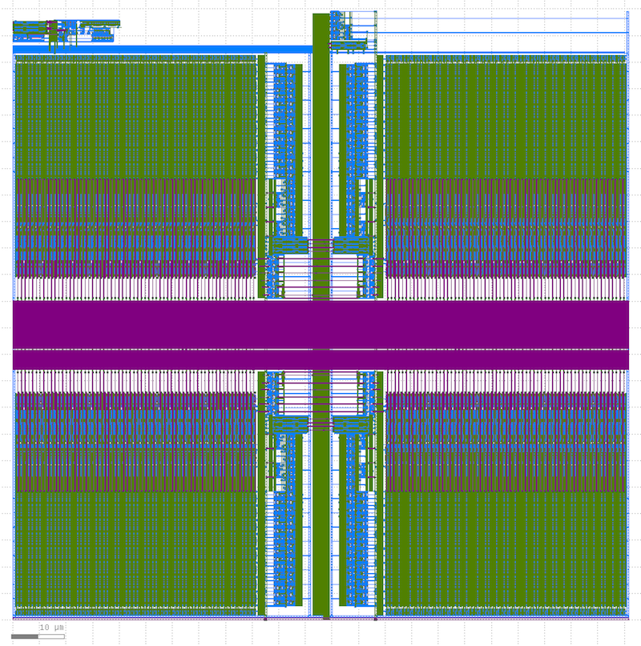

Notice how the SRAM is organized into four physical banks. Each physical
bank has 32 rows and and 32 bits per row. The peripherial logic is shared
in the middle of the physical banks. Using physical banks helps reduce
the length of the bitlines and wordlines which improves the delay and
energy efficiency of the design.

The following figure shows a closer look at a portion of the upper
right-hand physical bank.

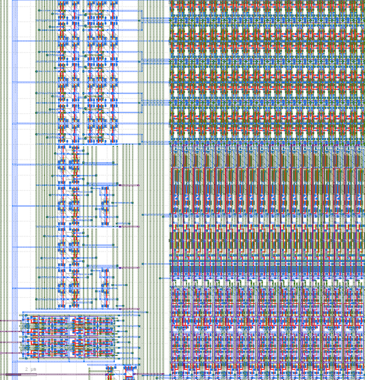

The array of bitcells is in the upper right-hand corner, the decoder
logic is on the left and the sense amp array and write driver array are
at the bottom.

The following figure shows the layout for a single SRAM bitcell.

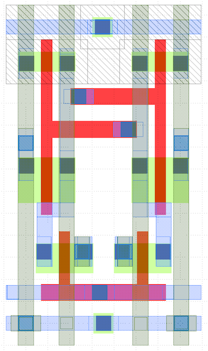

The word line is routed horizontally on M1 (blue) and the bit lines are
routed vertically on M2 (green). It looks like power and ground are
routed both vertically and horizontally. See if you can map the layout to
the canonical 6T SRAM bitcell transistor-level implementation.

Let’s look at snippet of the `.lib` file for the SRAM macro.

```
 % cd $TOPDIR/asic-manual/openram-mc/SRAM_64x64_1P/SRAM_64x64_1P
 % less SRAM_64x64_1P_*.lib
 ...
 cell (SRAM_64x64_1P) {
   area : 13267.5016125;
   ...
    bus(ADDR){
        bus_type       : ADDR;
        direction      : input;
        capacitance    : 0.2091;
        max_transition : 0.04;
        pin(ADDR[5:0]){
        timing(){
            timing_type : setup_rising;
            related_pin  : "clk";
            rise_constraint(CONSTRAINT_TABLE) {
            values("0.009, 0.009, 0.009",\
                   "0.009, 0.009, 0.009",\
                   "0.009, 0.009, 0.009");
            }
            fall_constraint(CONSTRAINT_TABLE) {
            values("0.009, 0.009, 0.009",\
                   "0.009, 0.009, 0.009",\
                   "0.009, 0.009, 0.009");
            }
        }
        timing(){
            timing_type : hold_rising;
            related_pin  : "clk";
            rise_constraint(CONSTRAINT_TABLE) {
            values("0.001, 0.001, 0.001",\
                   "0.001, 0.001, 0.001",\
                   "0.001, 0.001, 0.001");
              }
            fall_constraint(CONSTRAINT_TABLE) {
            values("0.001, 0.001, 0.001",\
                   "0.001, 0.001, 0.001",\
                   "0.001, 0.001, 0.001");
            }
        }
        }
    }
   ...
 }
```

As with the standard-cell library, the `.lib` includes information about
the area of the block, the capacitance on all pins, and power of the
circuit. By default OpenRAM will use analytical models to estimate this
characterization data which is probably why the timing values are not
varying within a look-up table. OpenRAM can also use spice simulations to
estimate this characterization data. These simulations will result in the
memory compiler taking significantly longer to generate the SRAM macros,
but will also result in much more accurate characterization data.

The `.lef` file will mostly contain large rectangular blockages which
mean that the ASIC tools should not route any M1, M2, M3 wires over the
SRAM (because they would accidentally create short circuits with the M1,
M2, M3 wires already in the SRAM macro). The `.lef` file also identifies
where all of the pins are physically located so the ASIC tools can
correctly connect to the SRAM macro.

Try experimenting with the configuration file to generate other SRAM
macros.

CACTI Memory Generator
--------------------------------------------------------------------------

While the OpenRAM memory generator is useful for understanding how memory
generators work in general, the SRAM macros produced by the OpenRAM
memory generator are less useful in this course since they do not support
partial writes. So to build SRAMs suitable for use in caches we would
need to combine many smaller SRAMs, and we would need to carefully write
only one of these smaller SRAMs for a partial write. Given these issues,
we will be using a different memory generator based on the CACTI memory
modeling tool.

The CACTI memory generator is not a "real" memory generator, but instead
it uses first-order analytical modeling to estimate the area, energy, and
timing of SRAMs (and other memory array structures). We can "abuse" the
CACTI modeling tool to serve as a memory generator by taking the area,
energy, and timing estimates from CACTI and inserting them into carefully
developed `.v`, `.lib`, and `.lef` templates. Essentially we are fooling
the ASIC tools into thinking we have a real SRAM macro, when really all
we have if is a rough first-order estimate of a real SRAM macro. This
works well enough for teaching, but keep in mind there is no "real"
layout for these SRAM macros.

The CACTI memory generator also uses a configuration file to specify the
various parameters for the desired SRAM macro. You can see an example
configuration file for the CACTI memory generator here:

```
 % cd $TOPDIR/asic-manual/cacti-mc
 % more SRAM_64x64_1P.cfg
 conf:
  baseName:   SRAM
  numWords:   64
  wordLength: 64
  numRWPorts: 1
  numRPorts:  0
  numWPorts:  0
  technology: 45
  opCond:     Typical
  debug:      False
  noBM:       False
```

You will only really want to change the `numWords` and the `wordLength`
parameters. As before, are generating a single-ported SRAM which has 64
rows and 64 bits per row for a total capacity of 4096 bits or 512B. If
you want to use a dual-ported SRAM you will need to work with the
instructors to modify the setup.

You can use the following commands to run the CACTI memory generator.

```
 % cd $TOPDIR/asic-manual/cati-mc
 % cacti-mc SRAM_64x64_1P.cfg
```

It will take a few minutes to generate the SRAM macro. You can see the
resulting views here:

```
 % cd $TOPDIR/asic-manual/cati-mc/SRAM_64x64_1P
 % ls -1
 SRAM_64x64_1P.v
 SRAM_64x64_1P.lib
 SRAM_64x64_1P.db
 SRAM_64x64_1P.lef
 SRAM_64x64_1P.mw
```

Notice there is no real layout nor transistor-level netlist. Instead, the
CACTI memory generator has produced: a Verilog behavior model; a `.lib`
file with information area, leakage power, capacitance of each input pin,
internal power, logical functionality, and timing; a `.db` file which is
a binary version of the `.lib` file; a `.lef` file which includes
information on the dimensions of the cell and the location and dimensions
of both power/ground and signal pins; and a `.mw` file which is a
Milkyway database representation of the SRAM macro based on the `.lef`.

The CACTI SRAM macros have a similar pin-level interface as the OpenRAM
SRAM macros with a few exceptions: the `CE` signal is used as the clock;
there are separate input/output data buses _but_ only one can be used at
a time since this is a single-ported SRAM; and there is an additional
`WBM` pin which is used as a write byte mask (i.e., for partial writes).

Using SRAMs in RTL Models
--------------------------------------------------------------------------

Now that we understand how an SRAM generator works, let's see how to
actually use an SRAM in your RTL models. We have create a behavioral SRAM
model in the `sim/sram` subdirectory.

```
 % cd $TOPDIR/sim/sram
 % ls
 ...
 SramPRTL.py
 SramVRTL.v
 SramRTL.py
```

There is both a PyMTL and Verilog version. Both are parameterized by the
number of words and the bits per word, and both have the same pin-level
interface:

 - `port0_val`: port enable
 - `port0_type`: transaction type (0 = read, 1 = write)
 - `port0_idx`: which row to read/write
 - `port0_wdata`: write data
 - `port0_wben`: write byte enable
 - `port0_rdata`: read data

SRAMs use a latency _sensitive_ interface meaning a user must carefully
manage the timing for correct operation (i.e., set the read address and
then exactly one cycle later use the read data). In addition, the SRAM
cannot be "stalled". To illustrate how to use SRAM macros, we will create
a latency _insensitive_ val/rdy wrapper around an SRAM which enables
writing and reading the SRAM using our standard memory messages. The
following figure illustrates a naive approach to implementing the SRAM
val/rdy wrapper.

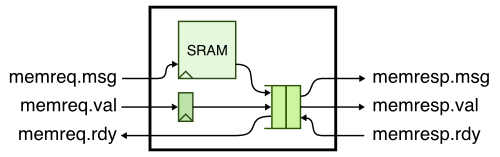

Consider what might happen if we use a single-element bypass queue. The
following pipeline diagram illustrates what can go wrong.

```
 cycle : 0  1  2  3  4  5  6  7  8
 msg a : M0 Mx
 msg b :    M0 Mx
 msg c :       M0 M1 M2 M2 M2       # M2 stalls on cycles 3-5
 msg d :          M0 M1 M1 M1 M2    # but wait, we cannot stall in M1!
 msg e :             M0 M0 M0 M0 Mx

 cycle M0 M1 [q] M2
    0: a
    1: b  a      a  # a flows through bypass queue
    2: c  b      b  # b flows through bypass queue
    3: d  c         # M2 is stalled, c will need to go into bypq
    4: e  d   c     # q is full at beginning of cycle, enq_rdy = 0
    5: e  ?   c     # what happens to d? cannot stall in M1!
```

Here we are using Mx to indicate when a transaction goes through M1 and
M2 in the same cycle because it flows straight through the bypass queue.
So on cycle 3, the response interface is stalled and as a consequence
message c must be enqueued into the memory response queue. On cycle 4,
the response queue is full (`enq_rdy` = 0) so `memreq_rdy` = 0 and
message e will stall in M0 (i.e., will stall waiting to be accepted by
the SRAM wrapper). The critical question is what happens to message d? It
_cannot_ stall in M1 because we cannot stall the SRAM. So basically we
just drop it. Increasing the amount of the buffering in the bypass queue
will not solve the problem. The key issue is that by the time we realize
the bypass queue is full we can potentially already have a transaction
executing in the SRAM, and this transaction cannot be stalled.

This is a classic situation where the need more skid buffering. A correct
solution will have two or more elements of buffering in the memory
response queue _and_ stall M0 if there are less than two free elements in
the queue. Thus in the worst case, if M2 stalls we have room for two
messages in the response queue: the message currently in M1 and the
message currently in M0. Here is the updated design:

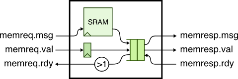

Here is the updated pipeline diagram.

```
 cycle : 0  1  2  3  4  5  6  7  8
 msg a : M0 Mx
 msg b :    M0 Mx
 msg c :       M0 M1 M2 M2 M2
 msg d :          M0 M1 q  q  M2     # msg c is in skid buffer
 msg e :             M0 M0 M0 M0 Mx

 cycle M0 M1 [q ] M2
    0: a
    1: b  a       a  # a flows through bypass queue
    2: c  b       b  # b flows through bypass queue
    3: d  c          # M2 is stalled, c will need to go into bypq
    4: e  d    c     #
    5: e      dc     # d skids behind c into the bypq
    6: e       d  c  # c is dequeued from bypq
    7: e          d  # d is dequeued from bypq
    8:    e       e  # e flows through bypass queue
```

Note, with a pipe queue you still need two elements of buffering. There
could be a message in the response queue when M2 stalls and then you
still don't have anywhere to put the message currently in M1.

Take a closer look at the SRAM val/rdy wrapper we provide you. Here is
the PyMTL version:

```
 % cd $TOPDIR/sim/tut8_sram
 % more SramValRdyPRTL.py
 from sram import SramRTL
 ...
 s.sram = m = SramRTL( num_bits, num_words )
```

And here is the Verilog version:

```
 % cd $TOPDIR/sim/tut8_sram
 % more SramValRdyVRTL.v
 `include "sram/SramVRTL.v"
 ...
 sram_SramVRTL#(32,256) sram
 (
   .clk         (clk),
   .reset       (reset),
   .port0_idx   (sram_addr_M0),
   .port0_type  (sram_wen_M0),
   .port0_wben  (sram_byte_wen_M0),
   .port0_val   (sram_en_M0),
   .port0_wdata (sram_write_data_M0),
   .port0_rdata (sram_read_data_M1)
 );
```

To use an SRAM in a PyMTL model, simply import `SramRTL`, instantiate the
SRAM, and set the number of words and number of bits per word. To use an
SRAM in a Verilog model, simply include `sram/SramVRTL.v` and again
instantiate the SRAM, and set the number of words and number of bits per
word.

We can run a test on the SRAM val/rdy wrapper like this:

```
 % mkdir -p $TOPDIR/sim/build
 % cd $TOPDIR/sim/build
 % py.test ../tut8_sram/test/SramValRdyRTL_test.py -k test_generic[random_0_3] -s
 ...
  2:
  3: wr:00:00000000:b1aa20f1ac2c79ec
  4: wr:01:00000008:eadb7347037714f4  wr:00:0:
  5: wr:02:00000010:f956c79b184e3089  #
  6: #                                #
  7: #                                #
  8: #                                wr:01:0:
  9: #                                #
 10: #                                #
 11: #                                #
 12: #                                wr:02:0:
 13: wr:03:00000018:af99be5f98bb9cf5  .
 14: wr:04:00000020:57dace845824f57a  wr:03:0:
 15: wr:05:00000028:567a0f9ff18ff8b2  #
 16: #                                wr:04:0:
```

The first write transaction takes a single cycle to go through the SRAM
val/rdy wrapper, but then the response interface is not ready on cycles
5-7. The second and third write transactions are still accepted by the
SRAM val/rdy wrapper and they will end up in the bypass queue, but the
fourth write transaction is stalled because the request interface is not
ready. No transactions are lost.

The SRAM module is parameterized to enable initial design space
exploration, but just because we choose a specific SRAM configuration
does not mean the files we need to create the corresponding SRAM macro
exist yet. Once we have finalized the SRAM size, we need to go through a
four step process.

**Step 1: See if SRAM configuration already exists**

The first step is to see if your desired SRAM configuration already
exists. You can do this by looking at the names of the `.cfg` files in
the `sim/sram` subdirectory.

```
 % cd $TOPDIR/sram
 % ls *.cfg
 SRAM_128x256_1P.cfg
 SRAM_32x256_1P.cfg
```

This means there are two SRAM configurations already available. One SRAM
has 256 words each with 128 bits and the other SRAM has 256 words each
with 32 bits. If the SRAM configuration you need already exists then you
are done and can skip the remaining steps.

**Step 2: Create SRAM configuration file**

The next step is to create a new SRAM configuration file. You must use a
very specific naming scheme. An SRAM with `N` words and `M` bits per word
must be named `SRAM_MxN_1P.cfg`. Create a configuration file named
`SRAM_64x64_1P.cfg` that we can use in the SRAM val/rdy wrapper. The
configuration file should contain the following contents:

```
 % cd $TOPDIR/sram
 % more SRAM_64x64_1P.cfg
 conf:
  baseName:   SRAM
  wordLength: 64
  numWords:   64
  numRWPorts: 1
  numRPorts:  0
  numWPorts:  0
  technology: 45
  opCond:     Typical
  debug:      False
  noBM:       False
```

**Step 3: Create an SRAM configuration RTL model**

The next step is to create an SRAM configuration RTL model. This new RTL
model should have the same name as the configuration file except a PyMTL
RTL model should use a `.py` filename extension and a Verilog RTL model
should use a `.v` filename extension. We have provided a generic SRAM RTL
model to make it easier to implement the SRAM configuration RTL model.
The generic PyMTL SRAM RTL model is in `SramGenericPRTL.py` and the
generic Verilog SRAM RTL model is in `SramGenericVRTL.v`. Go ahead and
create an SRAM configuration RTL model for the 64x64 configuration that
we used in the SRAM val/rdy wrapper.

Here is what this model should look like if you are using PyMTL:

```python
from pymtl           import *
from SramGenericPRTL import SramGenericPRTL

class SRAM_64x64_1P( Model ):

  # Make sure widths match the .v

  # This is only a behavior model, treated as a black box when translated
  # to Verilog.

  vblackbox      = True
  vbb_modulename = "SRAM_64x64_1P"
  vbb_no_reset   = True
  vbb_no_clk     = True

  def __init__( s ):

    # clock: in PyMTL simulation it uses implicit .clk port when
    # translated to Verilog, actual clock ports should be CE1

    s.CE1  = InPort ( 1  )  # clk
    s.WEB1 = InPort ( 1  )  # bar( write en )
    s.OEB1 = InPort ( 1  )  # bar( out en )
    s.CSB1 = InPort ( 1  )  # bar( whole SRAM en )
    s.A1   = InPort ( 6  )  # address
    s.I1   = InPort ( 64 )  # write data
    s.O1   = OutPort( 64 )  # read data
    s.WBM1 = InPort ( 8  )  # byte write en

    # instantiate a generic sram inside
    s.sram_generic = SramGenericPRTL( 64, 64 )

    s.connect( s.CE1,  s.sram_generic.CE1  )
    s.connect( s.WEB1, s.sram_generic.WEB1 )
    s.connect( s.OEB1, s.sram_generic.OEB1 )
    s.connect( s.CSB1, s.sram_generic.CSB1 )
    s.connect( s.A1,   s.sram_generic.A1   )
    s.connect( s.I1,   s.sram_generic.I1   )
    s.connect( s.O1,   s.sram_generic.O1   )
    s.connect( s.WBM1, s.sram_generic.WBM1 )
```

Notice how this is simply a wrapper around `SramGenericPRTL` instantiated
with the desired number of words and bits per word.

Here is what this model should look like if you are using Verilog:

```verilog
`ifndef SRAM_32x256_1P
`define SRAM_32x256_1P

`include "sram/SramGenericVRTL.v"

module SRAM_32x256_1P
(
  input         CE1,
  input         WEB1,
  input         OEB1,
  input         CSB1,
  input  [7:0]  A1,
  input  [31:0] I1,
  output [31:0] O1,
  input  [3:0]  WBM1
);

  sram_SramGenericVRTL
  #(
    .p_data_nbits  (32),
    .p_num_entries (256)
  )
  sram_generic
  (
    .CE1  (CE1),
    .A1   (A1),
    .WEB1 (WEB1),
    .WBM1 (WBM1),
    .OEB1 (OEB1),
    .CSB1 (CSB1),
    .I1   (I1),
    .O1   (O1)
  );

endmodule

`endif /* SRAM_32x256_1P */
```

Notice how this is simply a wrapper around `SramGenericVRTL` instantiated
with the desired number of words and bits per word.

**Step 3: Use new SRAM configuration RTL model in top-level SRAM model**

The final step is to modify the top-level SRAM model to select the proper
SRAM configuration RTL model. If you are using PyMTL, you will need to
modify `SramPRTL.py` like this:

```python
# Add this at the top of the file
from SRAM_64x64_1P  import SRAM_64x64_1P

...

   if   num_bits == 32 and num_words == 256:
      s.sram = m = SRAM_32x256_1P()
    elif num_bits == 128 and num_words == 256:
      s.sram = m = SRAM_128x256_1P()

    # Add the following to choose new SRAM configuration RTL model
    elif num_bits == 64  and num_words == 64:
      s.sram = m = SRAM_64x64_1P()

    else:
      s.sram = m = SramGenericPRTL( num_bits, num_words )
```

If you are using Verilog, you will need to modify `SramVRTL.v` like this:

```verilog
// Add this at the top of the file
`include "sram/SRAM_64x64_1P.v"

...

  generate
    if      ( p_data_nbits == 32  && p_num_entries == 256 )
      SRAM_32x256_1P  sram ( clk, ~t, 1'b0, ~v, i, wd, rd, wben );
    else if ( p_data_nbits == 128 && p_num_entries == 256 )
      SRAM_128x256_1P sram ( clk, ~t, 1'b0, ~v, i, wd, rd, wben );

    // Add the following to choose new SRAM configuration RTL model
    else if ( p_data_nbits == 64 && p_num_entries == 64 )
      SRAM_64x64_1P sram ( clk, ~t, 1'b0, ~v, i, wd, rd, wben );

    else
      SramGenericVRTL#(p_data_nbits,p_num_entries) sram
        (
          .CE1  ( clk  ),
          .WEB1 ( ~t   ),
          .OEB1 ( 1'b0 ),
          .CSB1 ( ~v   ),
          .A1   ( i    ),
          .I1   ( wd   ),
          .O1   ( rd   ),
          .WBM1(  wben )
        );
  endgenerate
```

One might ask what is the point of going through all of the trouble of
creating an SRAM configuration RTL model that is for a specific size if
we already have a generic SRAM RTL model. The key reason is that the ASIC
tools will use the _name_ of the SRAM to figure out where to swap in the
SRAM macro. So we need a explicit module name for every different SRAM
configuration to enable using SRAM macros in the ASIC tools.

**Step 4: Test new SRAM configuration**

The final step is to test the new configuration and verify everything
works. We start by adding a simple directed test to the `SramRTL_test.py`
test script. Here is an example:

```python
def test_direct_64x64( dump_vcd, test_verilog ):
  test_vectors = [ header_str,
    # val,  type,  wben,       idx,  wdata,              rdata
    [    1, 1,     0b11111111, 0x00, 0xdeadbeefcafe0123, '?'                ],
    [    1, 0,     0b00000000, 0x00, 0x0000000000000000, '?'                ],
    [    0, 0,     0b00000000, 0x00, 0x0000000000000000, 0xdeadbeefcafe0123 ],
    [    1, 1,     0b11111111, 0x3f, 0x0a0b0c0d0e0f0102, '?'                ],
    [    1, 0,     0b00000000, 0x3f, 0x0000000000000000, '?'                ],
    [    0, 0,     0b00000000, 0x00, 0x0000000000000000, 0x0a0b0c0d0e0f0102 ],
    [    1, 1,     0b11111111, 0x01, 0xaaaaaaaaaaaaaaaa, '?'                ],
    [    1, 1,     0b00000011, 0x01, 0x0123cafebeefdead, '?'                ],
    [    1, 0,     0b00000000, 0x01, 0x0000000000000000, '?'                ],
    [    0, 0,     0b00000000, 0x01, 0x0000000000000000, 0xaaaaaaaaaaaadead ],
    [    1, 1,     0b00001100, 0x01, 0x0123cafebeefdead, '?'                ],
    [    1, 0,     0b00000000, 0x01, 0x0000000000000000, '?'                ],
    [    0, 0,     0b00000000, 0x01, 0x0000000000000000, 0xaaaaaaaabeefdead ],
    [    1, 1,     0b00110000, 0x01, 0x0123cafebeefdead, '?'                ],
    [    1, 0,     0b00000000, 0x01, 0x0000000000000000, '?'                ],
    [    0, 0,     0b00000000, 0x01, 0x0000000000000000, 0xaaaacafebeefdead ],
    [    1, 1,     0b11000000, 0x01, 0x0123cafebeefdead, '?'                ],
    [    1, 0,     0b00000000, 0x01, 0x0000000000000000, '?'                ],
    [    0, 0,     0b00000000, 0x01, 0x0000000000000000, 0x0123cafebeefdead ],
  ]
  run_test_vector_sim( SramRTL(64, 64), test_vectors, dump_vcd, test_verilog )
```

This directed test writes a value to a specific word and then reads that
word to verify the value was written correctly. We test writing the first
word, the last word, and then partial word writes. We can run the
directed test like this:

```
 % cd $TOPDIR/sim/build
 % py.test ../sram/test/SramRTL_test.py -k test_direct_64x64
```

We have included a helper function that simplifies random testing. All
you need to do is add the configuration to the `sram_configs` variable in
the test script:

```
 sram_configs = [ (16, 32), (32, 256), (128, 256), (64,64) ]
```

Then you can run the random test like this:

```
 % cd $TOPDIR/sim/build
 % py.test ../sram/test/SramRTL_test.py -k test_random[64-64]
```

And of course we should run all of the tests to ensure we haven't broken
anything when adding this new configuration.

```
 % cd $TOPDIR/sim/build
 % py.test ../sram
```

Manual ASIC Flow with SRAM Macros
--------------------------------------------------------------------------

Now that we have added the desired SRAM configuration, we can use the
ASIC tools to generate layout for the SRAM val/rdy wrapper. In this
section, we will go through the steps manually, and in the next section
we will use the automated ASIC flow.

The first step is to run a simulator to generate the Verilog for pushing
through the flow.

```
 % cd $TOPDIR/sim/build
 % ../tut8_sram/sram-sim --impl rtl --input random --translate --dump-vcd
 % ls
 ...
 SramValRdyRTL.v
 SramValRdyRTL_blackbox.v
```

As an aside, the simulator will generate _two_ different Verilog files.
The first Verilog file is `SramValRdyRTL.v`, and it is a fully functional
RTL model which is what is actually simulated when use the `--translate`
command line option. The second Verilog file is
`SramValRdyRTL_blackbox.v` and it is what we use with the ASIC tools.
Search for the SRAM module in the blackbox Verilog file:

```
 % cd $TOPDIR/sim/build
 % less -p
 ...
 `default_nettype none
 module SRAM_64x64_1P
 (
   input  wire [   5:0] A1,
   input  wire [   0:0] CE1,
   input  wire [   0:0] CSB1,
   input  wire [  63:0] I1,
   output wire [  63:0] O1,
   input  wire [   0:0] OEB1,
   input  wire [   7:0] WBM1,
   input  wire [   0:0] WEB1
 );

 endmodule // SRAM_64x64_1P
 `default_nettype wire
```

Notice that this SRAM module is empty! In other words, in the blackbox
Verilog file, all SRAMs are implemented as "blackboxes" with no internal
functionality. If we included the behavioral implementation of the SRAM,
then Synopsys DC would try to synthesize the SRAM as opposed to using the
SRAM macro.

The next step is to run the CACTI memory generator to generate the SRAM
macro corresponding to the desired 64x64 configuration.

```
 % rm -rf $TOPDIR/asic-manual/cacti-mc/*
 % cd $TOPDIR/asic-manual/cacti-mc
 % cacti-mc ../../sim/sram/SRAM_64x64_1P.cfg
 % cd SRAM_64x64_1P
 % mv *.lib *.db *.lef *.mw ..
```

Now we can use Synopsys DC to synthesize the logic which goes around the
SRAM macro.

```
 % mkdir -p $TOPDIR/asic-manual/synopsys-dc
 % cd $TOPDIR/asic-manual/synopsys-dc
 % dc_shell-xg-t

 dc_shell> set_app_var target_library "$env(ECE5745_STDCELLS)/stdcells.db ../cacti-mc/SRAM_64x64_1P.db"
 dc_shell> set_app_var link_library   "* $env(ECE5745_STDCELLS)/stdcells.db ../cacti-mc/SRAM_64x64_1P.db"
 dc_shell> analyze -format sverilog ../../sim/build/SramValRdyRTL_blackbox.v
 dc_shell> elaborate SramValRdyRTL
 dc_shell> check_design
 dc_shell> create_clock clk -name ideal_clock1 -period 0.35
 dc_shell> compile
 dc_shell> write -format verilog -hierarchy -output post-synth.v
 dc_shell> exit
```

We are basically using the same steps we used in the Synopsys/Cadence
ASIC tool tutorial. Notice how we must point Synopsys DC to the `.db`
file generated by the CACTI memory generator so Synopsys DC knows the
abstract logical, timing, power view of the SRAM. Also notice how we are
pointing Synopsys DC to the blackbox Verilog.

If you look for the SRAM module in the synthesized gate-level netlist,
you will see that it is referenced but not declared. This is what we
expect since we are not synthesizing the memory but instead using an SRAM
macro.

```
 % cd $TOPDIR/asic-manual/synopsys-dc
 % less -p SRAM post-synth.v
```

Now we can use Cadence Innovus to place the SRAM macro and the standard
cells, and then automatically route everything together. We will be
running Cadence Innovus in a separate directory to keep the files
separate from the other tools.

```
 % mkdir -p $TOPDIR/asic-manual/cadence-innovus
 % cd $TOPDIR/asic-manual/cadence-innovus
```

As in the Synopsys/Cadence ASIC tool tutorial, we need to create two
files before starting Cadence Innovus. Use Geany or your favorite text
editor to create a file named `constraints.sdc`in
`$TOPDIR/asic-manual/cadence-innovus` with the following content:

```
 create_clock clk -name ideal_clock -period 0.35
```

Now use Geany or your favorite text editor to create a file named
`setup-timing.tcl` in `$TOPDIR/asic-manual/cadence-innovus` with the
following content:

```
 create_rc_corner -name typical \
    -cap_table "$env(ECE5745_STDCELLS)/rtk-typical.captable" \
    -T 25

 create_library_set -name libs_typical \
    -timing [list "$env(ECE5745_STDCELLS)/stdcells.lib" "../cacti-mc/SRAM_64x64_1P.lib"]

 create_delay_corner -name delay_default \
    -early_library_set libs_typical \
    -late_library_set libs_typical \
    -rc_corner typical

 create_constraint_mode -name constraints_default \
    -sdc_files [list constraints.sdc]

 create_analysis_view -name analysis_default \
    -constraint_mode constraints_default \
    -delay_corner delay_default

 set_analysis_view \
    -setup [list analysis_default] \
    -hold [list analysis_default]
```

This is very similar to the steps we used in the Synopsys/Cadence ASIC
tool tutorial, except that we have to include the `.lib` file generated
by the CACTI memory generator. Now let's start Cadence Innovus, load in
the design, and complete the power routing just as in the
Synopsys/Cadence ASIC tool tutorial.

```
 % cd $TOPDIR/asic-manual/cadence-innovus
 % innovus -64
 innovus> set init_mmmc_file "setup-timing.tcl"
 innovus> set init_verilog   "../synopsys-dc/post-synth.v"
 innovus> set init_top_cell  "SramValRdyRTL"
 innovus> set init_lef_file  "$env(ECE5745_STDCELLS)/rtk-tech.lef \
                              $env(ECE5745_STDCELLS)/stdcells.lef \
                              ../cacti-mc/SRAM_64x64_1P.lef"
 innovus> set init_gnd_net   "VSS"
 innovus> set init_pwr_net   "VDD"
 innovus> init_design
 innovus> floorPlan -su 1.0 0.70 4.0 4.0 4.0 4.0
 innovus> globalNetConnect VDD -type pgpin -pin VDD -inst * -verbose
 innovus> globalNetConnect VSS -type pgpin -pin VSS -inst * -verbose
 innovus> sroute -nets {VDD VSS}

 innovus> addRing -nets {VDD VSS} -width 0.6 -spacing 0.5 \
           -layer [list top 7 bottom 7 left 6 right 6]

 innovus> addStripe -nets {VSS VDD} -layer 6 -direction vertical \
           -width 0.4 -spacing 0.5 -set_to_set_distance 5 -start 0.5

 innovus> addStripe -nets {VSS VDD} -layer 7 -direction horizontal \
           -width 0.4 -spacing 0.5 -set_to_set_distance 5 -start 0.5
```

The following screen capture illustrates what you should see: a square
floorplan with a power grid.

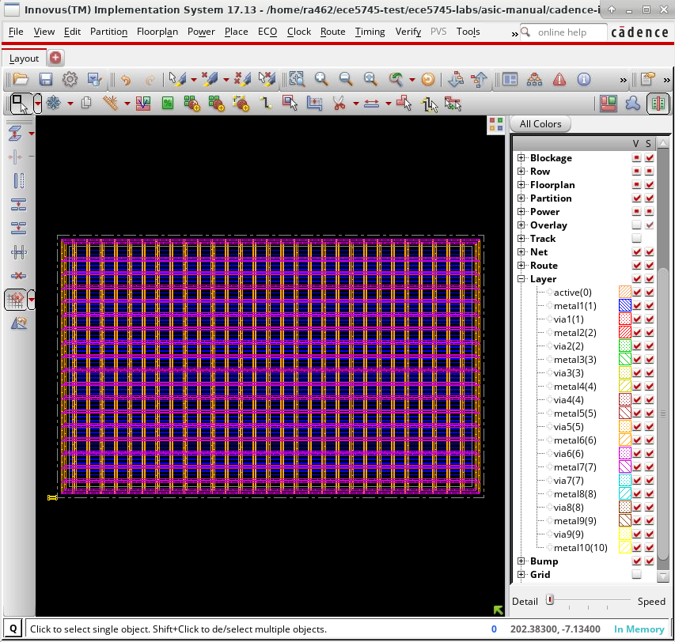

We can now do a simple placement and routing of the standard cells _and_
the SRAM macro in the floorplan, and then we can finalize the clock and
signal routing and add filler cells.

```
 innovus> place_design
 innovus> ccopt_design
 innovus> routeDesign
 innovus> setFillerMode -corePrefix FILL -core "FILLCELL_X4 FILLCELL_X2 FILLCELL_X1"
 innovus> addFiller
```

The following screen capture illustrates what you should see. The SRAM
macro is the large rectangle on the right-hand size of the floorplan. The
power grid has been hidden to make it easier to see the SRAM macro.

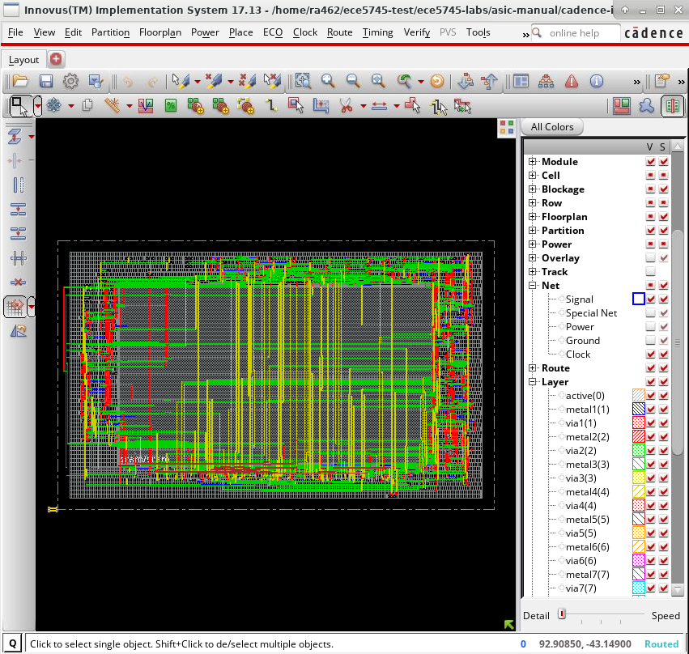

Cadence Innovus automatically placed the SRAM macro on the right and then
arranged the standard cells in rows to the left of the SRAM macro. The
SRAM macro pins are all on the bottom. The tool has automatically routed
all of the signals between the standard cells and these SRAM macro pins.
The following screen capture shows a closer look at this signal routing.

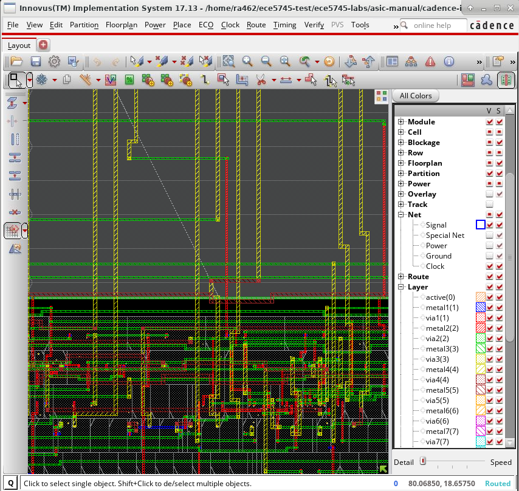

Notice how Cadence Innovus has used larger wires on higher metal layers
to do some of the global routing to and from the SRAM macro. The
following screen capture shows using _Windows > Workspaces > Design
Browser + Physical_ to highlight two parts of the design. The
standard-cells in the memory response queue are highlighted in red, and
the read data bus which connects the SRAM macro to this memory response
queue is highlighted in yellow.

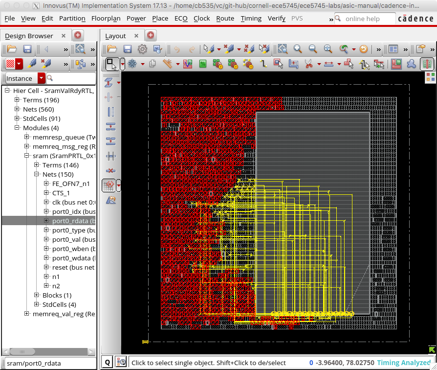

This should make it more clear how the tool routes this data bus between
the standard cells and the SRAM macro pins. Recall that the only logic in
the SRAM val/rdy wrapper besides the SRAM macro is an input register for
the memory request and the memory response queue. The memory response
queue has two entries and each entry is 110 bits for a total storage of
about 220 bits. The SRAM macro includes 64 entries, each of which is 64
bits for a total storage of 4096 bits. From the amoeba plot we can see
that the memory response queue is similar in size to the SRAM macro even
though the SRAM macro can store 18x more data! This clearly illustrates
the benefit of using an SRAM generator. We are able to generate much
denser memories, but also note that the SRAM macro has higher latency (a
full clock cycle vs. less than a cycle for the memory response queue) and
has lower throughput (a single port vs. a separate read and write port
for the memory response queue).

